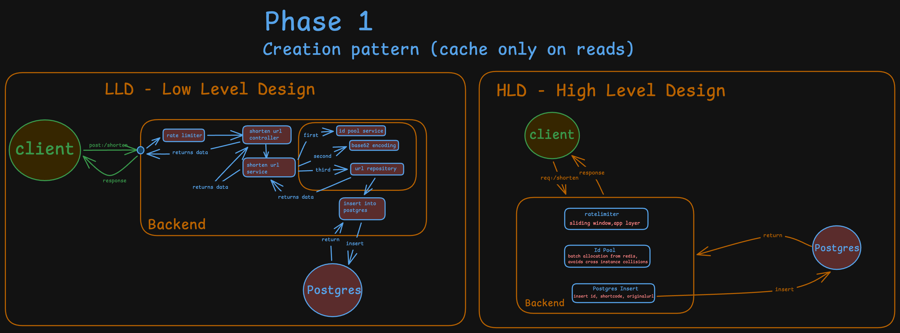
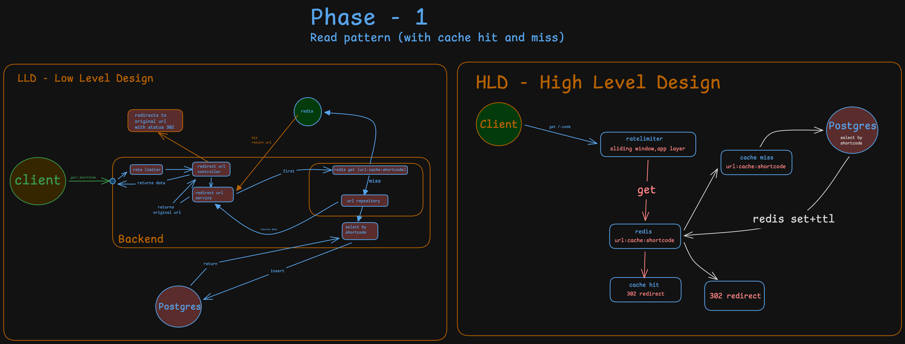

# shortly-scale

A rate-limited URL shortener with cache-aside reads, built to explore the real system design problem behind "just shorten a URL": **how do you generate unique short codes across multiple app instances without collisions, without coordination overhead on every request?**

This is project 1 of a 5-project backend systems series, each built deep enough to actually understand the tradeoffs involved, rather than stopping at surface-level completeness.

This README is a living document — it gets extended as new phases land, rather than frozen per phase. Historical snapshots live in git tags/commits, not separate files.

---

## Status

- ✅ **Phase 1 — Core mechanics** (this document covers Phase 1 in full below): rate limiting, cache-aside reads, collision-safe ID generation, write + read paths, tested end-to-end including multi-instance concurrency.
- ⬜ **Phase 2 — Auth**: API keys, per-key rate limiting, tiered limits, Feistel-cipher short code obfuscation (see [Known limitations](#known-limitations--deferred-work)).
- ⬜ **Phase 3 — Async analytics**: click tracking moved off the redirect's critical path via a queue.

---

## Phase 1 — Core mechanics

### Why this project first

Cheapest way to touch caching, DB indexing, and horizontal scaling decisions without needing novel infrastructure. Everything here is standard Node/Postgres/Redis — the value is in the decisions, not the stack.

---

### Tech stack

| Layer | Choice |
|---|---|
| Runtime | Node.js + TypeScript |
| Framework | Express |
| Database | PostgreSQL |
| ORM | Prisma (with `PrismaPg` adapter) |
| Cache / rate limiter store | Redis (`redis` v4+, not ioredis) |
| Validation | Zod |

---

### Architecture

Two request paths, each with distinct design decisions:

### Write path — `POST /api/url/shorten`

```
Client → Rate limiter → Controller → Service → [ID pool → base62 → Repository] → Postgres insert → Response
```

### Read path — `GET /:shortCode`

```
Client → Rate limiter → Controller → Service → Redis GET
                                                    ├─ hit  → 302 redirect
                                                    └─ miss → Postgres SELECT → Redis SET+TTL → 302 redirect
```

#### Diagrams

High-level design (system behavior, tradeoffs) and low-level design (code structure) for both paths:





---

### The core system design problem: ID generation

A short code needs to be **unique** and **short**. The interesting question is: how do you generate a unique numeric ID across multiple horizontally-scaled app instances, without every instance fighting over a single point of coordination on every request?

#### Options considered

| Approach | How it works | Tradeoff |
|---|---|---|
| **DB sequence** (`SERIAL`) | Postgres hands out the next ID via `INSERT ... RETURNING id` | Simple, but every write becomes a DB round-trip before you even know the request is valid. Bottleneck under write load. |
| **Snowflake-style** | Each instance computes `id = (timestamp << 22) \| (machineId << 12) \| sequence` locally | Zero coordination needed, but requires assigning each instance a unique `machineId` — an ops dependency not worth taking on for this project. |
| **Redis-backed ID pool (chosen)** | Each instance atomically claims a *batch* of IDs from Redis (`INCRBY counter 1000`), then hands out IDs from that local batch without touching Redis again until exhausted | Coordination cost drops from once-per-request to once-per-1000-requests. Real code to write and reason about — this is the part of the project actually worth demonstrating. |

#### Why the Redis pool won

- It's the version that requires writing genuine concurrency-safe logic — not trusting a library (Snowflake) or a database default (sequence) to solve the problem for you.
- It's directly testable: spin up two instances, hit both concurrently, and prove — from the actual data — that they never claim overlapping ranges.
- It mirrors a real production pattern (the "hi-lo" ID allocator, used in systems like Hibernate).

#### How it works

```typescript
let currentId = 0n;
let maxId = 0n;
let refillPromise: Promise<void> | null = null;
const BATCH_SIZE = 1000n;

async function refill() {
  const newMax = await redis.incrBy('idpool:counter', Number(BATCH_SIZE));
  maxId = BigInt(newMax);
  currentId = maxId - BATCH_SIZE;
}

async function getNextId(): Promise<bigint> {
  if (currentId >= maxId) {
    if (!refillPromise) {
      refillPromise = refill().finally(() => { refillPromise = null; });
    }
    await refillPromise;
  }
  return currentId++;
}
```

**Cross-instance safety**: guaranteed by Redis's `INCRBY` being atomic and centrally serialized — two instances calling it concurrently can never receive overlapping ranges, because Redis processes the increment as one indivisible operation.

**Within-instance concurrency safety**: `refillPromise` acts as an in-process lock. The first concurrent request to notice the local pool is exhausted starts the refill and stores the in-flight promise; every other concurrent request sees the lock is held and awaits the *same* promise instead of triggering a redundant refill or racing on the shared `currentId`/`maxId` state.

**Known tradeoff, accepted deliberately**: if an instance crashes with unused IDs still in its local batch, those IDs are gone forever — never reused. This is fine here because the base62 keyspace is enormous and uniqueness matters, not density.

#### Numeric ID → short code: base62

The Redis pool guarantees uniqueness of a *number*. Base62 encoding is a reversible bijection that turns that number into a URL-safe string — no separate uniqueness check on the string is ever needed, because a unique number always produces a unique encoded string.

```typescript
const ALPHABET = '0123456789ABCDEFGHIJKLMNOPQRSTUVWXYZabcdefghijklmnopqrstuvwxyz';
// 62 characters — all URL-safe, unlike base64's `+` and `/`
```

---

### Caching: cache-aside on reads

Redis is a read-optimization layer, not a source of truth — Postgres owns the data.

- **Pattern**: cache-aside. On a redirect request, check Redis first; on a miss, fall through to Postgres and populate the cache for next time.
- **TTL**: 1 hour, a deliberate middle ground. URL click patterns are typically Zipfian (a few links get most of the traffic) — too short a TTL keeps evicting popular links, too long wastes memory on links that were clicked once and never again. At larger scale, this would be paired with an LFU eviction policy (`maxmemory-policy allkeys-lfu`) so popular links stay cached independent of TTL timing.
- **Invalidation**: TTL-only, no explicit invalidation on write. URL mappings essentially never change after creation, so there's no staleness risk to guard against.
- **Failure mode**: fail-open. If Redis is unreachable, cache reads/writes are caught, logged, and treated as a miss/no-op — Postgres still serves the request. Redis being down should degrade performance, not break the product.

---

### Rate limiting: sliding window, app layer

- **Algorithm**: sorted-set-based sliding window (via Redis `ZADD`/`ZREMRANGEBYSCORE`/`ZCARD`), not a fixed counter + TTL. A naive counter allows bursts at window boundaries (e.g. N requests at 0:59 and another N at 1:01); a sorted-set sliding window doesn't have this gap.
- **Placement**: application layer, not edge. In production, coarse IP-based limiting would sit at the edge (API gateway / CDN) for DDoS-scale protection, while business-logic-aware limiting (per-API-key, per-plan-tier) stays in the app — this project only has the app layer, so the logic-aware limiting lives here.
- **Scope**: per-IP for now (no auth yet). Phase 2 will move this to per-API-key with tiered limits.
- **Failure mode**: fail-open on Redis errors — a broken rate limiter shouldn't take down the whole app; log and let the request through.

---

### Known limitations / deferred work

- **Sequential, enumerable short codes.** IDs from the Redis pool are sequential, so early short codes (`0`, `1`, `2`...) are short, guessable, and enumerable in order.
  - *Applied fix*: seeded the Redis counter to start at `62³ = 238328` (guarded with `SET ... NX` so it's safe to run on every instance startup without re-seeding an already-initialized counter). Guarantees a minimum 4-character code from the first ID onward.
  - *Deferred to Phase 2*: pass the ID through a reversible Feistel cipher (bit-scrambling) before base62 encoding, so codes are non-sequential and non-enumerable while remaining decodable back to the original ID if ever needed. Not implemented yet — the offset fix was enough for this phase, and the Feistel approach adds real complexity for a problem that's about polish, not correctness.
- **No auth / API keys yet** — Phase 2.
- **Analytics are synchronous with the redirect** — stretch goal is to move click tracking to an async queue (BullMQ) so it never blocks the redirect response.

---

### Issues encountered

**BigInt JSON serialization.** Prisma's `BigInt` type isn't serializable by `JSON.stringify` out of the box — throws at response time. Fixed by never returning the raw numeric `id` to the client at all; the service layer only returns `shortCode`, `originalUrl`, `shortUrl`, `createdAt`.

**Prisma model naming (`URL` → `Url`).** Naming a model as a fully-uppercase acronym (`model URL`) makes Prisma generate `prisma.uRL` (naive camelCase — lowercases only the first letter). Renamed the model to `Url` for a clean `prisma.url` client property.

**False-positive ID collision on a second multi-instance test run.** A `PrismaClientKnownRequestError: Unique constraint failed on (id)` appeared when running two instances concurrently. Root cause was a stale compiled `dist/` build on one instance, still running an older version of the ID pool logic — not a flaw in the Redis allocation mechanism itself. Confirmed by doing a clean `rm -rf dist` rebuild on both instances and re-running the same concurrent test: zero collisions, with Postgres data showing two disjoint 1000-ID batches (`238328–239327` and `239328–240327`) correctly allocated to each instance via Redis's atomic `INCRBY`.

---

### API

#### `POST /api/url/shorten`

```json
// Request
{ "originalUrl": "https://example.com/some/long/path" }

// Response (201)
{
  "statusCode": 201,
  "success": true,
  "message": "Url shortened successfully",
  "data": {
    "shortUrl": "http://localhost:3000/2TX",
    "shortCode": "2TX",
    "originalUrl": "https://example.com/some/long/path",
    "createdAt": "2026-08-25T04:11:46.229Z"
  }
}
```

#### `GET /:shortCode`

Issues a `302` redirect to the original URL. Not a JSON endpoint — this is the actual product surface, meant to be visited directly, not called programmatically.

---

### Project structure

```
src/
├── config/         # env, redis client, prisma client singletons
├── routes/         # url.route.ts, redirect.route.ts, main.routes.ts
├── controllers/     # url.controller.ts, redirect.controller.ts
├── services/         # url.service.ts, redirect.service.ts, idPool.service.ts, cache.service.ts
├── repository/       # url.repository.ts — the only layer that touches Prisma
├── middlewares/       # rateLimiter, validate, error handling
├── utils/             # base62, ApiError, ApiResponse, asyncHandler
└── validators/         # Zod schemas
```

Controller → service → repository split, chosen deliberately so the cache-aside and ID-generation logic is unit-testable in isolation, without mocking Express's `req`/`res`.

---

## Project series roadmap

1. ✅ Rate-Limited URL Shortener with Analytics *(this project)*
2. Outbox-Pattern Order System
3. Realtime Presence and Chat with horizontal scaling
4. CQRS and Event Sourcing Mini Ledger
5. Multi-Tenant Distributed Job Scheduler

Each project gets a "what broke and how I fixed it" writeup, same as above — the goal is actually understanding the systems involved, not just working code.